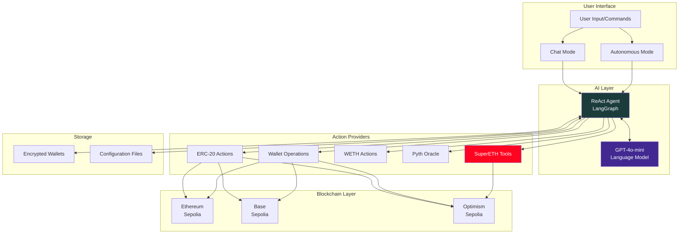
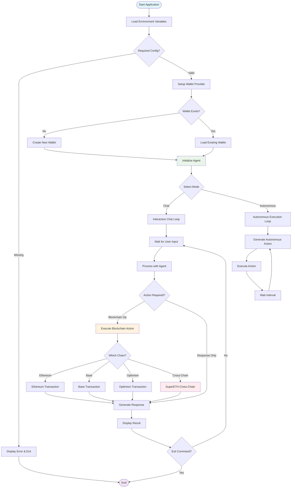
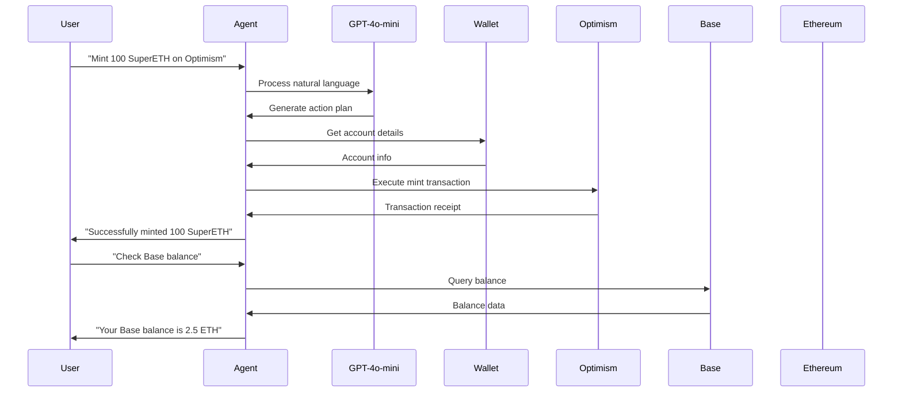

# 🤖 Multi-Chain Web3 Chatbot Agent

An AI-powered blockchain interaction agent built with LangChain and Coinbase Developer Platform (CDP) AgentKit. Perform complex blockchain operations across multiple networks through natural language conversation or autonomous execution.


## 🌟 Features

- **🧠 AI-Powered**: Powered by GPT-4o-mini for intelligent blockchain interactions
- **🌐 Multi-Chain**: Support for Ethereum, Base, and Optimism networks
- **🔄 Cross-Chain**: SuperETH token minting and burning across chains
- **💬 Conversational**: Natural language interface for blockchain operations
- **🤖 Autonomous**: Self-operating mode for automated blockchain actions
- **🔐 Secure**: Encrypted wallet management with persistent storage
- **🛠️ Extensible**: Modular architecture for adding new networks and features

## 🏗️ System Architecture



## 🔄 Control Flow



## 🚀 Quick Start

### Prerequisites

- **Python 3.10+**
- **uv** package manager
- **CDP API Key** from Coinbase Developer Platform
- **OpenAI API Key**

### Installation

1. **Clone the repository**
   ```bash
   git clone <repository-url>
   cd langchain-eth-account-chatbot
   ```

2. **Install dependencies**
   ```bash
   uv sync
   ```

3. **Configure environment**
   ```bash
   cp .env.example .env
   # Edit .env with your API keys and configuration
   ```

4. **Run the chatbot**
   ```bash
   # Optimism Sepolia (default)
   uv run chatbot.py
   
   # Base Sepolia
   uv run agent2.py
   
   # Ethereum Sepolia
   uv run agent3.py
   ```

## ⚙️ Configuration

### Environment Variables

```bash
# Required API Keys
CDP_API_KEY_ID=your_cdp_api_key_id
CDP_API_KEY_SECRET=your_cdp_api_secret
OPENAI_API_KEY=your_openai_api_key

# Network Configuration
NETWORK_ID=base-sepolia  # or ethereum-sepolia, optimism-sepolia

# Contract Addresses (Chain-specific)
OPTIMISM_CONTRACT_ADDRESS=0x1234567890123456789012345678901234567890
BASE_SEPOLIA_CONTRACT_ADDRESS=0xabcdefabcdefabcdefabcdefabcdefabcdefabcd
ETHEREUM_CONTRACT_ADDRESS=0x9876543210987654321098765432109876543210

# Optional RPC URLs
OPTIMISM_RPC_URL=https://sepolia.optimism.io
BASE_RPC_URL=https://sepolia.base.org
ETHEREUM_RPC_URL=https://sepolia.infura.io/v3/YOUR_PROJECT_ID
```

### Supported Networks

| Network | Chain ID | Agent File | Purpose |
|---------|----------|------------|---------|
| **Optimism Sepolia** | 11155420 | `chatbot.py` | Primary SuperETH operations |
| **Base Sepolia** | 84532 | `agent2.py` | Base ecosystem interactions |
| **Ethereum Sepolia** | 11155111 | `agent3.py` | Ethereum mainnet testing |

## 🛠️ Project Structure

```
langchain-eth-account-chatbot/
├── chatbot.py              # Main Optimism agent
├── agent2.py               # Base Sepolia agent
├── agent3.py               # Ethereum Sepolia agent
├── agent4.py               # Additional agent variant
├── supereth_tools.py       # LangChain tool wrappers
├── supereth_helper.py      # Core Web3 implementation
├── supereth_abi.json       # SuperETH contract ABI
├── .env                    # Environment configuration
└── wallet_data_*.txt       # Chain-specific wallet files
```

## 🔧 Core Components

### 1. Agent System

```python
# ReAct Agent with multiple action providers
def initialize_agent(config: EthAccountWalletProviderConfig):
    llm = ChatOpenAI(model="gpt-4o-mini")
    
    # Action providers
    actions = [
        erc20_action_provider(),
        wallet_action_provider(), 
        weth_action_provider(),
        pyth_action_provider()
    ]
    
    # Add custom SuperETH tools
    tools.extend([mint_supereth_crosschain, burn_supereth_crosschain])
    
    return create_react_agent(llm, tools)
```

### 2. Wallet Management

```python
# Secure wallet handling with persistence
def setup():
    provider_config = EthAccountWalletProviderConfig(
        private_key=load_or_create_wallet(),
        chain_id=get_chain_id()
    )
    return provider_config
```

### 3. Cross-Chain Operations

```python
# SuperETH cross-chain functionality
@tool
def mint_supereth_crosschain(to_address: str, amount: str):
    """Mint SuperETH tokens cross-chain to specified address"""
    return crosschain_mint(account, to_address, amount)

@tool  
def burn_supereth_crosschain(from_address: str, amount: str):
    """Burn SuperETH tokens cross-chain from specified address"""
    return crosschain_burn(account, from_address, amount)
```

## 💬 Usage Examples

### Chat Mode

```bash
> What's the current price of ETH?
Agent: The current price of Ethereum (ETH) is $2,340.50 USD.

> Transfer 0.1 ETH to 0x742d35Cc8100C90d2d6E5D4b4B3...
Agent: Successfully transferred 0.1 ETH to the specified address. 
Transaction hash: 0xabc123...

> Mint 100 SuperETH tokens to my address
Agent: Minting 100 SuperETH tokens cross-chain...
Transaction successful! Tokens minted to your address.
```

### Autonomous Mode

```bash
> Starting autonomous mode...
[10:30:45] Agent: Checking ETH price and considering arbitrage opportunities...
[10:30:55] Agent: Minting 50 SuperETH tokens for liquidity provision...
[10:31:05] Agent: Swapping 0.05 ETH for USDC on Base...
```

## 🔄 Multi-Chain Workflow



## 🎯 Advanced Features

### Action Providers

- **ERC-20 Operations**: Transfer, approve, check balances
- **WETH Integration**: Wrap/unwrap ETH seamlessly  
- **Price Oracle**: Real-time price data via Pyth
- **Wallet Management**: Account creation, key management
- **SuperETH Tools**: Cross-chain token operations

### Security Features

- **Encrypted Storage**: Wallet data encrypted at rest
- **Chain Isolation**: Separate wallets per network
- **Safe Parsing**: Input validation and sanitization
- **Error Handling**: Comprehensive exception management

## 🚀 Deployment

### Local Development

```bash
# Install dependencies
uv sync

# Run with different networks
uv run chatbot.py      # Optimism Sepolia
uv run agent2.py       # Base Sepolia  
uv run agent3.py       # Ethereum Sepolia
```

### Production Setup

```bash
# Set production environment variables
export CDP_API_KEY_ID="prod_key_id"
export CDP_API_KEY_SECRET="prod_key_secret"
export OPENAI_API_KEY="prod_openai_key"

# Run with production settings
python chatbot.py
```

### Docker Deployment

```dockerfile
FROM python:3.11-slim

WORKDIR /app
COPY requirements.txt .
RUN pip install -r requirements.txt

COPY . .
EXPOSE 8000

CMD ["python", "chatbot.py"]
```

## 🧪 Testing

```bash
# Test wallet creation
python -c "from chatbot import setup; setup()"

# Test cross-chain functionality
python -c "from supereth_helper import connect_to_optimism; connect_to_optimism()"

# Interactive testing
uv run chatbot.py
> help  # Shows available commands
```

## 📊 Monitoring & Analytics

The agent provides comprehensive logging:

- **Transaction History**: All blockchain interactions logged
- **Performance Metrics**: Response times and success rates
- **Error Tracking**: Detailed error logs with context
- **Chain Analytics**: Per-network operation statistics

## 🔮 Roadmap

- [ ] **Mainnet Support**: Deploy to production networks
- [ ] **DeFi Integration**: Uniswap, Aave, Compound interactions
- [ ] **NFT Operations**: Mint, transfer, marketplace interactions
- [ ] **Advanced Strategies**: Yield farming, arbitrage automation
- [ ] **Web Interface**: Browser-based chat interface
- [ ] **Mobile App**: React Native mobile application
- [ ] **Plugin System**: Third-party tool integration

## 🤝 Contributing

We welcome contributions! Please follow these guidelines:

1. **Fork the repository**
2. **Create a feature branch** (`git checkout -b feature/amazing-feature`)
3. **Add tests** for new functionality
4. **Update documentation** as needed
5. **Submit a pull request**

### Development Setup

```bash
# Clone your fork
git clone https://github.com/yourusername/langchain-eth-account-chatbot.git

# Install development dependencies
uv sync --dev

# Run tests
pytest

# Format code
black .
isort .
```

## 🛡️ Security

- **Private Key Protection**: Never log or expose private keys
- **Input Validation**: All user inputs sanitized
- **Network Security**: RPC endpoints over HTTPS
- **Error Handling**: Graceful failure without data exposure

### Reporting Security Issues

Please report security vulnerabilities to: security@yourproject.com

## 📄 License

This project is licensed under the MIT License - see the [LICENSE](LICENSE) file for details.

## 🙏 Acknowledgments

- **Coinbase Developer Platform** - For the excellent AgentKit
- **LangChain** - For the powerful AI framework
- **OpenAI** - For GPT-4o-mini language model
- **Ethereum Foundation** - For the robust blockchain infrastructure

---

**Built with ❤️ for the Web3 community using LangChain, CDP AgentKit, and multi-chain architecture**
